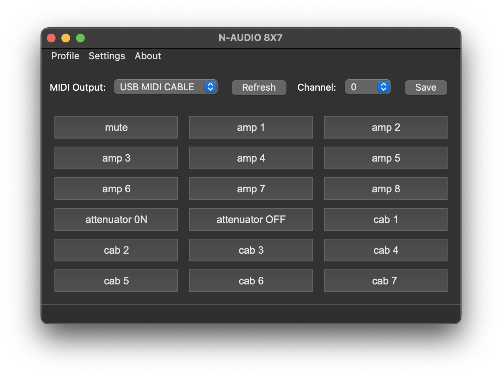
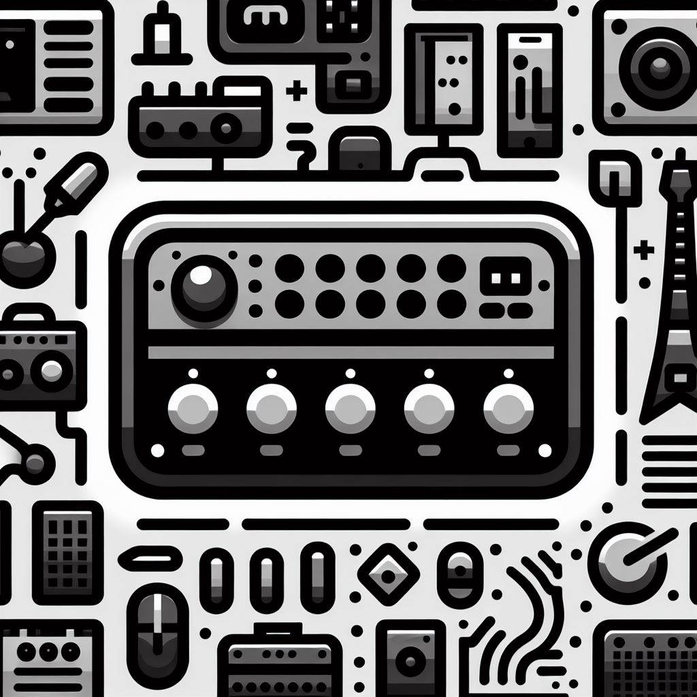
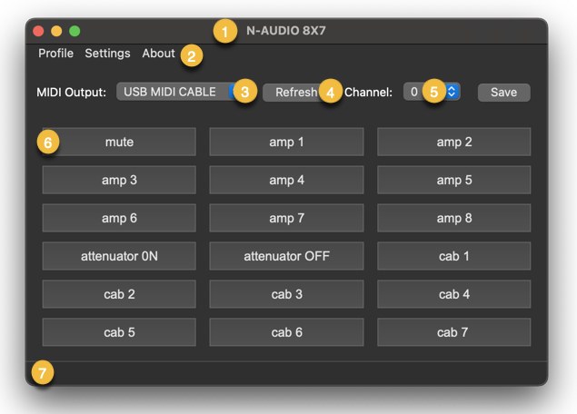
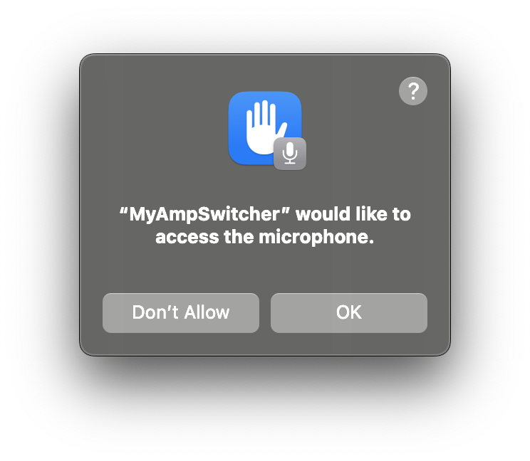

# MY AMP SWITCHER

MyAmpSwitcher is a Python application that allows you to control your amplifier, amp-cab-switcher or any device through MIDI messages. You can switch between different profiles, each containing customizable buttons that send MIDI Program Change and Control Change messages.

This software is released under [the MIT license](./license).

## Overview

This application provides a graphical user interface written using QT libraries for managing your amplifier or amp and cab switcher profiles and MIDI settings. It allows you to create, edit, load, import, and export profiles. You can easily switch between profiles and send MIDI messages to control your amplifier settings.

Preview of the MacOS version:


Please note that MyAmpSwitcher can run on MacOS/Windows/Linux considering that is built with Python and QT and Midi libraries are ported across these platforms.




## Settings

The application uses a settings file (`settings.json`) to store MIDI output port, channel, default profile, and other configuration details. You can edit these settings within the application to customize the behaviour according to your setup.

This is a sample of the [settings.json](./settings.json):
```json
{
    "port_name": "USB MIDI CABLE",
    "profile": "n-audio-8X7.json",
    "icon": "icon.ico",
    "font": "Arial",
    "size": 14,
    "buttons_per_row": 3
}
```

## Profiles

Profiles are JSON files stored in the ["profiles"](./profiles/) folder. Each profile contains information about the channel, button configurations, and other settings. You can create new profiles, edit existing ones, and switch between them seamlessly.
Profiles can be edited within the app or via any text editor.

This is a profile for a Brunetti XL" R-EVO: 

```json
{
    "name": "Brunetti XL\" R-EVO",
    "channel": 0,
    "buttons": [
        {
            "order": 0,
            "color": "green",
            "program_change": 2,
            "name": "clean"
        },
        {
            "order": 1,
            "color": "yellow",
            "program_change": 1,
            "name": "boost"
        },
        {
            "order": 2,
            "color": "red",
            "program_change": 3,
            "name": "xlead"
        }
    ]
}
```

## Profile Notes
Each profile should be saved with a meaningful ```"name"``` field, when loaded the name will appear as the window's title. Each button should have ```"name"``` have a ```"program_change"``` and/or ```"cc_number" ```and ```"cc_value"```.

## Installation instruction from GitHub

To run the MyAmpSwitcher application, follow these steps:

1. Clone the repository to your local machine.

   ```bash
   git clone https://github.com/paolofrigo/my-amp-switcher.git
   ```

2. Create a virtual environment and activate it
   on macos/linux
    ```bash
    cd my-amp-switcher
    python3 -m venv .venv
    source .venv/bin/activate
    ```
   on windows
   ```powershell
    cd my-amp-switcher
    python3 -m venv .venv
    .venv\bin\activate
    ```

4. Installing the dependencies
    ```bash
    pip install -r requirements.txt
    ```

5. Running the app.
    ```
    python3 MyAmpSwitcher.py
    ```

## User Interface Notes
The application has 2 main configuration files. "Settings" (settings.json) for visualization preferences/defaults and profiles (individually saved under the profiles folder) specific to the functions they are designed to perform.

This is the layout of the app:

1. The window title is set to the profile name loaded.
2. The file menu allows users to manage profiles under 'Profiles', general 'Settings', and review the current version using the 'About' section.
Toolbar section
3. Dropdown with available and showing the MIDI Output currently selected.
4. Refresh button to reload all available MIDI Outputs (in case they have changed since the app startup)
5. Dropdown of Midi Channel and showing what is selected in the loaded profile.
The "Save" button will write any change applied to the dropdown in the toolbar to the settings (Midi Output) and profile (Channel) files.
6. All Button labels and MIDI messages are defined in the profile, instead text size and the number of buttons for each row are defined in the settings.
7. The status bar displays MIDI Messages and user notifications.

## Usage
* Please make sure you connect your MIDI interface before opening My-Amp-Swticher.

* Please consider that your OS when launching the app may require your authorisation to allow the app to access your microphone.


## Show Your Support
Don't forget to give a ⭐️ on GitHub if you find this app useful!

## Disclaimer
THE SOFTWARE IS PROVIDED "AS IS," WITHOUT WARRANTY OF ANY KIND, EXPRESS OR IMPLIED. IN NO EVENT SHALL THE AUTHORS OR COPYRIGHT HOLDERS BE LIABLE FOR ANY CLAIM, DAMAGES, OR OTHER LIABILITY ARISING FROM, OUT OF, OR IN CONNECTION WITH THE SOFTWARE OR THE USE OR OTHER DEALINGS IN THE SOFTWARE.
